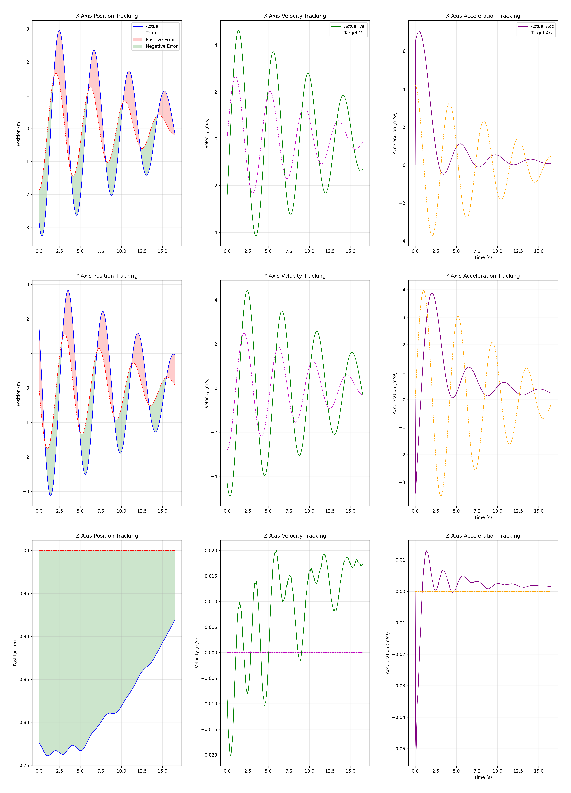

# PID 控制器
## 零、后续工作
- 📝完善README，实验室通过修改飞控参数，可以实现**无人机的定点手动遥控**，这样即使在控制器/规划器出现BUG的时候，**仍可以通过切换为定点模式手动降落，不需要有自稳模式的飞行经验**
- 📝 增加Yaw角约束，当无人机快速转向的时候不会发生失控
- 📝 增加高度约束，当无人机超过一定高度认为无人机失控，停止控制。
- 📝 限制起飞速度，针对悬停模式增加PID

## 一、项目概述
本项目 `pid_ctrl` 是一个基于 ROS（Robot Operating System）的 PID控制器相关代码库，主要用于四轴飞行器的轨迹跟踪控制。它包含了多种轨迹生成器、PID 数据记录器和可视化工具，能够帮助用户实现飞行器的不同轨迹飞行，并对 PID 控制的性能进行分析和评估。

https://github.com/Zhefan-Xu/tracking_controller/assets/55560905/5a83ede2-a8a2-4c7a-a5f4-3dd3304e9ad0

https://github.com/user-attachments/assets/28321dd7-60d3-4f61-940d-227ff98c5790



## 二、功能模块
### 1. 轨迹生成器
- **`eight_test.py`**：生成八字形轨迹。用户可以通过参数配置 X 轴振幅、Y 轴振幅、角速度、相位差等，实现不同形状的八字形轨迹。
- **`circle_test.py`**：生成圆形轨迹。支持设置圆的半径、达到最大半径的时间、速度等参数，还可以进行航向控制。
- **`fixed_point.py`**：发布固定点位置指令，可设置固定点的 X、Y、Z 坐标和航向角。

### 2. PID 数据记录器
- **`pid_analyzer.py`**：记录实际位置、速度、加速度以及目标位置、速度、加速度等数据，并将其保存为 CSV 文件 `pid_tracking_data.csv`，方便后续分析。

### 3. PID 数据可视化工具
- **`pid_vis.py`**：读取 `pid_tracking_data.csv` 文件，绘制 3x3 分析图表，展示 X、Y、Z 三个轴的位置、速度、加速度的跟踪情况，并计算增强性能指标，如最大超调、稳态误差、均方根误差等。

### 4. 跟踪控制器
- **`tracking_controller_node.cpp`**：四轴飞行器的跟踪控制器节点，依赖于 `trackingController` 类实现控制逻辑。
- **`trackingController.cpp`**：实现了状态机流程，包括检查里程计、判断是否开始规划、是否超时等，根据不同状态发布起飞指令、悬停指令或计算并发布新控制量。

### 5. 辅助工具
- **`utils.h`**：包含一些常用的数学函数，如四元数与欧拉角的转换、四元数乘法等。
- **`controller_param.yaml`**：PID 控制器的参数配置文件，包括位置、速度的 PID 参数，以及一些控制选项，如是否使用 FCU 控制等。

## 三、安装与使用
### 1. 安装依赖
确保你已经安装了 ROS，并且安装了所需的消息包，如 `nav_msgs`、`geometry_msgs` 等。

### 2. 克隆代码库
```bash
git clone https://github.com/HNU-CAT/pid_ctrl.git
```

### 3. 编译代码
将代码库放在 ROS 工作空间的 `src` 目录下，然后在工作空间根目录下执行编译命令：
```bash
catkin_make
```

### 4. 运行轨迹生成器
以八字形轨迹为例：

**STEP1：启动控制器**
```bash
#运行控制器，等待输入
roslaunch tracking_controller tracking_controller.launch
```

**STEP2：解锁无人机、自动起飞**
- CASE1：仿真
  - 在QGC里收到设置飞行模式为`OFFBOARD`，之后`ARM`。发现无人机自动起飞到1m的高度悬停，等待控制指令

- CASE2：实物
  - 首先确定处于定点模式，其次切换通道A切换飞行模式为`OFFBOARD`，之后切换通道B解锁无人机

**STEP3:发布控制指令**
```bash
#运行控制器，等待输入
roslaunch tracking_controller pub_cmd.launch 
```


**STEP4:记录控制效果，分析控制性能**
```bash

rosrun tracking_controller pid_vis.py
```
可以根据需要修改 `launch` 文件中的参数，或者在运行时通过 `rosparam set` 命令修改参数。

## 四、配置文件说明
### `controller_param.yaml`
该配置文件主要用于对控制器的各项参数进行配置，以下是详细说明：

#### 1. ROS 话题配置
此部分用于设置控制器订阅和发布的 ROS 话题，这些话题是控制器与其他节点进行数据交互的关键。
- **订阅话题（Subscribing Topics）**：
    - `odom_topic`：机器人的里程计信息话题，控制器通过订阅该话题获取机器人当前的位置和速度信息，默认值为 `/iris_0/mavros/vision_odom/odom`。
    - `imu_topic`：机器人的惯性测量单元（IMU）数据话题，用于获取机器人的姿态和加速度信息，默认值为 `/iris_0/mavros/imu/data`。
    - `target_topic`：期望的目标状态话题，控制器根据该话题接收到的目标信息进行轨迹跟踪控制，默认值为 `/planning/pos_cmd`。

- **发布话题（Publishing Topics）**：
    - `attitude_target_topic`：向 PX4 飞行控制器发送姿态控制指令的话题，默认值为`/mavros/setpoint_raw/attitude`。
    - `position_arget_topic`：向 PX4 飞行控制器发送本地位置控制指令的话题，默认为`/mavros/setpoint_raw/local`。
    - `/tracking_controller/robot_pose`：发布机器人当前的位姿信息，用于可视化或其他节点获取机器人的实时位置。
    - `/tracking_controller/trajectory_history`：发布机器人的历史轨迹信息，方便观察机器人的运动轨迹。
    - `/tracking_controller/target_pose`：发布目标的当前位姿信息，用于对比机器人与目标的位置关系。
    - `/tracking_controller/target_trajectory_history`：发布目标的历史轨迹信息。
    - `/tracking_controller/vel_and_acc_info`：发布机器人的速度和加速度状态信息。

#### 2. 控制模式配置
这部分配置决定了控制器采用的控制模式，用户可以根据实际需求进行选择。
- `use_fcu_ctrl`：是否使用飞行控制单元（FCU）进行控制，设置为 `false` 表示不使用 FCU 控制，使用控制器自身的控制算法；设置为 `true` 则直接使用 FCU 进行控制。
- `body_rate_control`：是否进行机体角速度控制，默认值为 `false`。
- `attitude_control`：是否进行姿态控制，默认值为 `false`。
- `acceleration_control`：是否进行加速度控制，默认值为 `true`，**即主要采用加速度控制模式。**

#### 3. PID 参数配置
PID（比例 - 积分 - 微分）控制器是该项目中用于轨迹跟踪的核心算法，此部分配置位置和速度的 PID 参数，可根据实际情况进行调整以优化控制效果。

- **位置（外环）PID 参数**：
    - `position_p`：位置控制的比例系数，格式为 `[X, Y, Z]`，默认值为 `[1.5, 1.5, 1.5]`，可提高 X、Y 方向的响应速度。
    - `position_i`：位置控制的积分系数，默认仅在 Z 轴设置了积分项 `[0.0, 0.0, 0.2]`，用于消除 Z 方向的稳态误差。
    - `position_d`：位置控制的微分系数，默认去掉了 X、Y 方向的微分作用 `[0.0, 0.0, 0.1]`。

- **速度（内环）PID 参数**：
    - `velocity_p`：速度控制的比例系数，格式为 `[X, Y, Z]`，默认值为 `[0.6, 0.6, 0.6]`，可提高 X、Y 方向的响应速度，Z 方向略有提升。
    - `velocity_i`：速度控制的积分系数，默认保持为 `[0.0, 0.0, 0.0]`，避免积分震荡。
    - `velocity_d`：速度控制的微分系数，默认去掉了 X、Y 方向的微分作用 `[0.0, 0.0, 0.1]`。

#### 4. 其他参数配置
- `attitude_control_tau`：姿态控制的时间常数，默认值为 `0.3`，当 `attitude_control` 为 `true` 时该参数生效。
- `hover_thrust`：悬停推力，该参数对控制效果至关重要，需要根据实际情况进行精确调整，默认值为 `0.70`。
- `verbose`：是否显示详细的调试信息，设置为 `false` 表示不显示。
- `IGNORE_ACC_VEL` 和 `IGNORE_ACC`：用于忽略速度或加速度信息，默认值均为 `false`。

### 调参指南
- 从位置和速度的比例控制（P 控制）开始调参，初始值要小，每次增加不超过 20%。
- 如果 Z 方向的位置存在稳态误差，可以适当增加位置积分系数（`position_i`）。
- 一般情况下，位置微分（`position_d`）、速度积分（`velocity_i`）和速度微分（`velocity_d`）参数可以不使用。 

## 五、注意事项
- 确保里程计和 IMU 数据正常发布，否则控制器可能无法正常工作。
- 在调整 PID 参数时，建议按照配置文件中的调参指南进行操作，逐步调整参数以获得更好的控制效果。
- 
