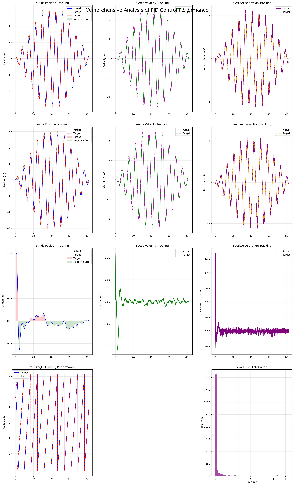

# PID 控制器 🎮

## 目录 📑
1. [后续工作](#零后续工作)
2. [项目概述](#一项目概述)
3. [功能模块](#二功能模块)
4. [安装与使用](#三安装与使用)
5. [配置文件说明](#四配置文件说明)
6. [注意事项](#五注意事项)

## 1、后续工作 🚧
- 📝 完善 README：实验室通过修改飞控参数，可实现**无人机的定点手动遥控**。这样，即使在控制器/规划器出现 BUG 时，**仍可切换至定点模式手动降落，无需自稳模式飞行经验**。
- 📝 研究更底层控制逻辑：当前控制量为**XYZ 三轴加速度和偏航速度**，后续将研究推力 + 姿态或推力 + 加速度的控制方式。
- 📝 增加 Yaw 角约束：防止无人机快速转向时失控。
- 📝 增加高度约束：当无人机超过一定高度时，判定为失控并停止控制。
- 📝 限制起飞速度：针对悬停模式增加 PID 控制。

## 2、项目概述 🌟
本项目 `pid_ctrl` 是一个基于 ROS（Robot Operating System）的 PID 控制器相关代码库，主要用于四轴飞行器的轨迹跟踪控制。它集成了多种轨迹生成器、PID 数据记录器和可视化工具，能够帮助用户实现飞行器的不同轨迹飞行，并对 PID 控制的性能进行分析和评估。

### 项目演示 🎥
https://github.com/Zhefan-Xu/tracking_controller/assets/55560905/5a83ede2-a8a2-4c7a-a5f4-3dd3304e9ad0

https://github.com/user-attachments/assets/28321dd7-60d3-4f61-940d-227ff98c5790

### 控制器分析图 📊


## 3、功能模块 🧰
### 1. 轨迹生成器 🛣️
- **`eight_test.py`**：生成八字形轨迹，可配置 X 轴振幅、Y 轴振幅、角速度、相位差等参数。
- **`circle_test.py`**：生成圆形轨迹，可配置半径、达到最大半径的时间、航向控制、速度等参数。
- **`fixed_point.py`**：发布固定点轨迹，可配置固定点的 X、Y、Z 坐标和航向角。

### 2. PID 数据记录器 📝
- **`pid_analyzer.py`**：订阅里程计和控制指令话题，记录实际位置、目标位置、实际速度、目标速度、实际加速度、目标加速度等数据，并定期保存为 CSV 文件。

### 3. 可视化工具 📈
- **`pid_vis.py`**：加载并预处理 PID 跟踪数据，绘制位置、速度、加速度跟踪曲线，直观展示控制效果。

### 4. 主控制器 🎛️
- **`trackingController.cpp`**：初始化控制器参数，注册发布器和回调函数，实现 PID 控制逻辑。

### 5. 辅助工具 🛠️
- **`utils.h`**：包含一些常用的数学函数，如四元数与欧拉角的转换、四元数乘法等。
- **`controller_param.yaml`**：PID 控制器的参数配置文件，包括位置、速度的 PID 参数，以及一些控制选项，如是否使用 FCU 控制等。

## 4、安装与使用 💻
### 0. 飞控设置
**如果想实现定点模式下无人机的手动控制，需要进行额外的设置**。这个设置并不复杂但是极力推荐：当**控制器/规划器出现BUG**的时候发现无人机失控，只要定位没有飘都可以通过切换回手动控制让无人机悬停在原地，极大的保障了飞机的安全，不需要有自稳模式下飞行的经验就能救机。
#### 0.1 设置原理

在手动控制无人机时，飞控有多种模式，如`自稳`、`姿态`、`定高`、`定点`。前边两个通过飞控计算稳定无人机，但是一般无人机都会飘；后边需要有额外的传感器数据，来帮助飞控实现定高飞行、
定点飞行。因此为了实现`定点`飞行，需要将LIO/VIO/动作捕捉等定位方式产生的定位信息转发给飞控。

具体原理参考官网链接链接（）

#### 0.2 LIO转发定位信息

因此在获得LIO信息之后可以转发给飞控，参考[代码程序](https://github.com/HNU-CAT/high_fast_lio2/blob/4f5a9ec6f9c3a73515d17d5277ea7c73271becd8/FAST_LIO/src/laserMapping.cpp#L193-L199)：    
```
geometry_msgs::PoseStamped pose_msg;
 // 填充 PoseStamped 消息的 header
pose_msg.header = odomHigh.header;
// 填充 PoseStamped 消息的 pose（位置和姿态）
pose_msg.pose = odomHigh.pose.pose;
// 发布转换后的 PoseStamped 消息
pubOdomtoPx4.publish(pose_msg);
```
#### 0.3 设置飞控参数

修改飞控中参数


### 1. 安装依赖 📦
确保你已经安装了 ROS，并且安装了所需的消息包，如 `nav_msgs`、`geometry_msgs` 等。

### 2. 克隆代码库 📋
将代码库克隆到 ROS 工作空间的 `src` 目录下：
```bash
cd ~/catkin_ws/src
git clone <repository_url>
```

### 3. 编译代码 ⚙️
在工作空间根目录下执行编译命令：
```bash
cd ~/catkin_ws
catkin_make
```

### 4. 运行节点 🚀
根据需要运行不同的节点，例如：
- 运行八字形轨迹生成器：
```bash
rosrun pid_ctrl eight_test.py
```
- 运行 PID 数据记录器：
```bash
rosrun pid_ctrl pid_analyzer.py
```
- 运行可视化工具：
```bash
rosrun pid_ctrl pid_vis.py <csv_file_path>
```

## 5、配置文件说明 📄
### `controller_param.yaml`
该配置文件主要用于对控制器的各项参数进行配置，以下是详细说明：

#### 1. ROS 话题配置 🗣️
此部分用于设置控制器订阅和发布的 ROS 话题，这些话题是控制器与其他节点进行数据交互的关键。
- **订阅话题（Subscribing Topics）**：
    - `odom_topic`：机器人的里程计信息话题，控制器通过订阅该话题获取机器人当前的位置和速度信息，默认值为 `/iris_0/mavros/vision_odom/odom`。
    - `imu_topic`：机器人的惯性测量单元（IMU）数据话题，用于获取机器人的姿态和加速度信息，默认值为 `/iris_0/mavros/imu/data`。
    - `target_topic`：期望的目标状态话题，控制器根据该话题接收到的目标信息进行轨迹跟踪控制，默认值为 `/planning/pos_cmd`。

- **发布话题（Publishing Topics）**：
    - `attitude_target_topic`：向 PX4 飞行控制器发送姿态控制指令的话题，默认值为 `/mavros/setpoint_raw/attitude`。
    - `position_arget_topic`：向 PX4 飞行控制器发送本地位置控制指令的话题，默认为 `/mavros/setpoint_raw/local`。
    - `/tracking_controller/robot_pose`：发布机器人当前的位姿信息，用于可视化或其他节点获取机器人的实时位置。
    - `/tracking_controller/trajectory_history`：发布机器人的历史轨迹信息，方便观察机器人的运动轨迹。
    - `/tracking_controller/target_pose`：发布目标的当前位姿信息，用于对比机器人与目标的位置关系。
    - `/tracking_controller/target_trajectory_history`：发布目标的历史轨迹信息。
    - `/tracking_controller/vel_and_acc_info`：发布机器人的速度和加速度状态信息。

#### 2. 控制模式选择 🎯
- `body_rate_control`：是否启用机体角速度控制。
- `attitude_control`：是否启用姿态控制。
- `acceleration_control`：是否启用加速度控制。
- `use_fcu_ctrl`：是否使用飞控自带的控制器。

#### 3. PID 参数配置 🎚️
PID（比例 - 积分 - 微分）控制器是该项目中用于轨迹跟踪的核心算法，此部分配置位置和速度的 PID 参数，可根据实际情况进行调整以优化控制效果。

- **位置（外环）PID 参数**：
    - `position_p`：位置控制的比例系数，格式为 `[X, Y, Z]`，默认值为 `[1.5, 1.5, 1.5]`，可提高 X、Y 方向的响应速度。
    - `position_i`：位置控制的积分系数，默认仅在 Z 轴设置了积分项 `[0.0, 0.0, 0.2]`，用于消除 Z 方向的稳态误差。
    - `position_d`：位置控制的微分系数，默认去掉了 X、Y 方向的微分作用 `[0.0, 0.0, 0.1]`。

- **速度（内环）PID 参数**：
    - `velocity_p`：速度控制的比例系数，格式为 `[X, Y, Z]`，默认值为 `[0.6, 0.6, 0.6]`，可提高 X、Y 方向的响应速度，Z 方向略有提升。
    - `velocity_i`：速度控制的积分系数，默认保持为 `[0.0, 0.0, 0.0]`，避免积分震荡。
    - `velocity_d`：速度控制的微分系数，默认去掉了 X、Y 方向的微分作用 `[0.0, 0.0, 0.1]`。

#### 4. 其他参数配置 ⚙️
- `yaw_p`、`yaw_i`、`yaw_d`：偏航角的 PID 参数。
- `attitude_control_tau`：姿态控制的时间常数。
- `hover_thrust`：悬停推力。
- `verbose`：是否输出详细信息。
- `IGNORE_ACC`：是否忽略加速度信息。
- `IGNORE_ACC_VEL`：是否忽略加速度和速度信息。

## 6、注意事项 ⚠️
- 在使用前，请确保已经正确配置 `controller_param.yaml` 文件。
- 建议在仿真环境中进行测试，根据实际情况调整 PID 参数。
- 当出现异常情况时，可查看 `pid_analyzer.py` 保存的 CSV 文件，分析控制效果。
